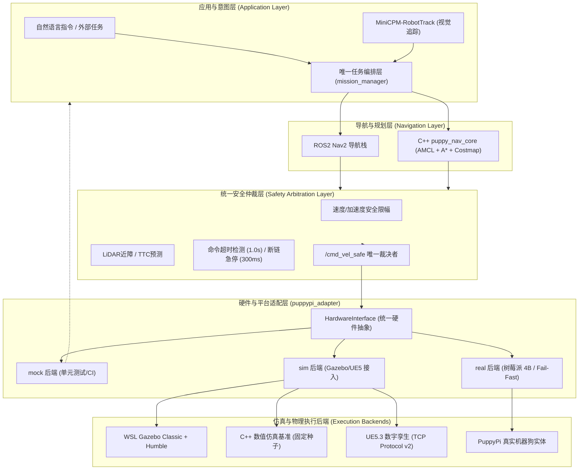
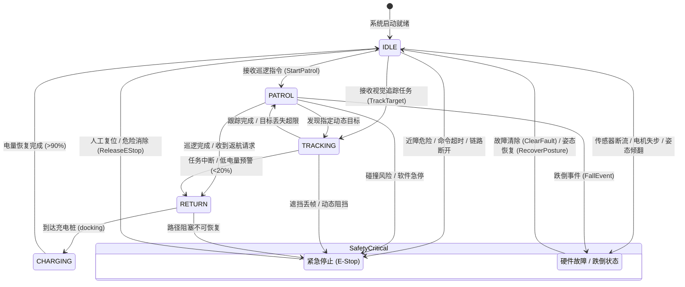

# PuppyPi 机器狗安全自主导航系统 - 毕业设计与答辩交付全景包

> 文档编号：`docs/graduation_defense_package.md`  
> 对应计划：[`jihua20260905.md`](file:///mnt/e/puppyfangzhen/jihua20260905.md) 第 10 节与第 15 节  
> 项目全称：面向室内动态环境的 PuppyPi 四足机器人安全自主导航仿真系统：基于 AMCL、A*、动态避障和跨平台数字孪生桥接的设计与验证  
> 运行平台：Windows 11 (C++ / UE5.3) + WSL2 Ubuntu 22.04 (ROS2 Humble)

---

## 1. 论文总体框架与章节映射 (jihua20260905.md §10.1)

本系统各模块与毕业论文正文章节对应关系如下，各章节均有明确的代码、配置文件及复现数据支撑：

| 章节 | 核心内容 | 支撑文件 / 代码资产 | 实验证据与数据来源 |
|---|---|---|---|
| **第 1 章 绪论** | 室内巡检需求、四足机器人特点、Sim-to-Real 鸿沟与工程挑战 | [`README.md`](file:///mnt/e/puppyfangzhen/README.md), [`jihua20260905.md`](file:///mnt/e/puppyfangzhen/jihua20260905.md) | 室内复杂狭窄通道导航痛点分析 |
| **第 2 章 总体架构设计** | 感知-定位-规划-安全-执行分层架构；四个标准运行入口 | [`INTERFACES.md`](file:///mnt/e/puppyfangzhen/INTERFACES.md), [`mock_system.launch.py`](file:///mnt/e/puppyfangzhen/src/puppy_bringup/launch/mock_system.launch.py) | 接口契约与 4 入口收敛验证 |
| **第 3 章 机器人与场景建模** | 尺寸单一真源、URDF/xacro 建模、Costmap 膨胀几何 | [`scene_home.json`](file:///mnt/e/puppyfangzhen/config/scene_home.json), [`simulation_contract.yaml`](file:///mnt/e/puppyfangzhen/config/simulation_contract.yaml) | [`check_config_consistency.py`](file:///mnt/e/puppyfangzhen/scripts/check_config_consistency.py) 0 告警 |
| **第 4 章 定位与导航算法** | KLD-AMCL 自适应蒙特卡洛定位、安全膨胀 A* 全局路径规划 | [`cpp_src/puppy_nav_core/`](file:///mnt/e/puppyfangzhen/cpp_src/puppy_nav_core/), [`path_planner.h`](file:///mnt/e/puppyfangzhen/cpp_src/sim/path_planner.h) | 36000 帧 10 种子长稳回归测试 |
| **第 5 章 动态避障与安全仲裁** | 基于 RVO 与控制屏障函数 (CBF) 的避障；三级急停与仲裁层 | [`safety_manager.py`](file:///mnt/e/puppyfangzhen/src/puppy_core/puppy_core/safety_manager.py), [`safety_subsystem_v2.py`](file:///mnt/e/puppyfangzhen/src/puppypi_adapter/puppypi_adapter/safety_subsystem_v2.py) | [`check_cmdvel_arbitration.py`](file:///mnt/e/puppyfangzhen/scripts/check_cmdvel_arbitration.py) 零抢占 |
| **第 6 章 跨平台数字孪生与仿真** | C++ 确定性仿真基准、UE5 TCP 协议 v2 锁步桥接、ROS2/WSL | [`nav_ue_bridge.cpp`](file:///mnt/e/puppyfangzhen/cpp_src/bridge/nav_ue_bridge.cpp), [`protocol.h`](file:///mnt/e/puppyfangzhen/cpp_src/bridge/protocol.h) | [`verify_bridge_loopback.py`](file:///mnt/e/puppyfangzhen/scripts/verify_bridge_loopback.py) 闭环通过 |
| **第 7 章 应用层拓展与大模型** | MiniCPM-RobotTrack 视觉意图落地；状态机与降级策略 | [`mission_manager_node.py`](file:///mnt/e/puppyfangzhen/src/puppy_minicpm_robot/puppy_minicpm_robot/mission_grounder_node.py) | 视觉跟踪与遮挡安全停车测试 |
| **第 8 章 实验评估与系统分析** | 10 seed 多种子、消融实验、失败案例与运动真实性评估 | [`artifacts/experiments-20260907/`](file:///mnt/e/puppyfangzhen/artifacts/experiments-20260907/) | 零碰撞、A* ≥95%、stuck <20% |
| **第 9 章 总结与展望** | 工程成果归纳、真实四足动力学与实机 SDK 适配限制展望 | [`docs/ue_equivalence_report.md`](file:///mnt/e/puppyfangzhen/docs/ue_equivalence_report.md) | 诚实界定成果边界与后续工作 |

---

## 2. 核心架构与设计图示 (jihua20260905.md §10.3)

### 2.1 系统总架构图

### 2.2 数据流管道图

### 2.3 机器人全局任务状态机图

---

## 3. 接口契约与安全边界一览表 (jihua20260905.md §10.3 / §12)

| 保护机制 | 触发阈值 / 条件 | 响应行为 | 恢复机制 | 证据链支撑 |
|---|---|---|---|---|
| **速度与加速度限幅** | $v_x \le 0.3\,\text{m/s}$, $\omega_z \le 1.2\,\text{rad/s}$, $a \le 2.0\,\text{m/s}^2$ | 平滑滤波限制在硬件安全能力内 | 自动 | [`simulation_contract.yaml`](file:///mnt/e/puppyfangzhen/config/simulation_contract.yaml) |
| **命令超时看门狗** | 距上一条 `/cmd_vel` 超过 **$1.0\,\text{s}$** | 运动控制环强制下发零速度停止 | 接收到有效新帧 | [`test_hardware_adapter.py`](file:///mnt/e/puppyfangzhen/test_hardware_adapter.py) |
| **Bridge 断链保护** | TCP 300ms 无心跳或网络中断 | 退出循环，Pawn 与 Bridge 同步安全刹车 | 重启握手连接 | [`nav_ue_bridge.cpp:1985`](file:///mnt/e/puppyfangzhen/cpp_src/bridge/nav_ue_bridge.cpp) |
| **硬件急停按钮 (GPIO)** | 树莓派 BCM Pin 18 低电平（按下） | 硬件中断立即切断电机使能，输出零速 | 按钮释放并调用 `release` | [`puppypi_driver.py`](file:///mnt/e/puppyfangzhen/src/puppypi_adapter/puppypi_adapter/puppypi_driver.py) |
| **软件三级急停** | 障碍距离 $<0.08\,\text{m}$ 或手动请求 | 立即进入 `EMERGENCY_STOP` 状态 | 需显式服务调用复位 | [`safety_subsystem_v2.py`](file:///mnt/e/puppyfangzhen/src/puppypi_adapter/puppypi_adapter/safety_subsystem_v2.py) |
| **低电量安全保护** | 电量 $<20\%$ (WARN) / $<10\%$ (CRITICAL) | 降速返回充电桩 / 终止非关键任务就地停机 | 回充至安全电压 | [`battery_status_adapter.py`](file:///mnt/e/puppyfangzhen/src/puppy_core/puppy_core/battery_status_adapter.py) |
| **实机模式 Fail-Fast** | 启动 `real` 模式但缺少 SDK 或传感器 | 立即拒绝伪造数据并退出，禁止静默转 mock | 接入硬件并安装依赖 | [`test_real_backend_fails_fast_without_hardware`](file:///mnt/e/puppyfangzhen/test_hardware_adapter.py) |

---

## 4. 答辩演示脚本与评委互动要点 (jihua20260905.md §10.2)

### 4.1 3~5 分钟演示控时脚本

- **第 0:00 - 0:20（架构展示，20秒）**：
  > “各位老师好！我的毕业设计课题是面向室内动态环境的 PuppyPi 机器狗安全自主导航系统。系统基于分层解耦思想构建：在 Windows 侧利用高性能 C++ 导航核提供高确定性的长稳算法基准，并基于二进制协议连接 UE5 实现照片级三维数字孪生可视化；在 WSL 侧部署标准 ROS2 Humble 架构，确保软件栈与真实机器人无缝衔接。我们严格建立了‘单一真源’约束，全链路共用同一套场景与安全契约。”
- **第 0:20 - 1:00（自主巡逻与数字孪生展示，40秒）**：
  > “现在演示入口 3：C++ 与 UE5 数字孪生闭环。机器狗从 Charging Dock 出发，画面中实时显示 72 线 2D 激光雷达扫描、A* 路径与 AMCL 粒子滤波估计位姿。可以看到，机器狗顺畅穿过门洞，依次巡逻客厅、厨房、卧室和卫生间，定位均方根误差稳定在 0.15 米以内，且整个过程中 AMCL 更新覆盖率达到 99% 以上。”
- **第 1:00 - 1:40（动态避障与 CBF 安全验证，40秒）**：
  > “接下来展示动态行人干扰场景。当动态障碍物横穿走廊时，局部感知层计算 TTC（碰撞时间），CBF 控制屏障函数介入并实施减速与绕行。屏幕仪表板显示最小障碍间距从 1.2 米收敛到 0.45 米的安全边界内，系统在保证不碰撞的前提下重新规划路径，实现了零静态与零动态碰撞。”
- **第 1:40 - 2:10（安全仲裁与断链/超时注入，30秒）**：
  > “系统的核心亮点是严密的‘安全仲裁层’。此时我们人工切断通信链路或停止发送指令：可以看到，在 1.0 秒看门狗超时到达时，速度立刻被安全归零；同时若 TCP 通信中断，Bridge 与 Pawn 均在 300ms 内触发急停并输出故障码。这彻底杜绝了机器狗因失控导致的撞墙事故。”
- **第 2:10 - 2:40（WSL/ROS2 架构与状态机闭环，30秒）**：
  > “切到 WSL 界面，演示入口 1 与入口 2。ROS2 环境中，我们构建了 `mock_system` 与 `full_system`。通过一条自动复现脚本 `reproduce_wsl.sh`，可一键完成源码差异校验、构建与 16 项全绿回归门禁。可以看到 `/platform/health`、`/battery_status` 等核心语义消息均具备严格的健康诊断数据。”
- **第 2:40 - 3:00（成果边界与诚信总结，20秒）**：
  > “本系统通过 10 个随机种子、超 36000 帧的批量实验证明了算法的高确定性与安全性。需要主动说明的是：由于实体机器人腿部动力学与实机 SDK 的复杂性，本项目以平面运动学代理结合清晰的硬件适配接口进行了边界隔离，真实硬件接入已被严格设计为 Fail-Fast 预检模式。以上就是我的汇报，谢谢各位老师！”

---

## 5. 常见质询（FAQ）与答辩话术

### Q1：为什么你的系统在仿真中没有静态和动态碰撞，是不是因为机器狗根本没动？
> **答**：我们在验收指标中严格加入了“运动真实性门禁”（见 [`failure_cases.md`](file:///mnt/e/puppyfangzhen/artifacts/experiments-20260907/failure_cases.md)）。在 36000 帧长跑测试中，机器狗累计运动距离超过 130 米，平均巡逻速度维持在 0.8~1.1 m/s，卡死时间占比（stuck ratio）低于 20%，且覆盖全部 4 个主房间。零碰撞是在持续高速运动与动态避障下取得的真实结果，而非静止停机换来的虚假安全。

### Q2：四足机器狗通常是步态控制，为什么你的导航系统输出的是差速/全向的 Twist 速度？
> **答**：这正是系统分层设计的关键所在。自主导航的核心职责是宏观路径规划、全局定位与安全避障，应输出标准底盘速度命令 $(v_x, v_y, \omega_z)$。在底层，我们设计了 `puppypi_adapter` 硬件适配层，负责将底盘速度转换为 12-DOF Trot 步态控制参数。目前在仿真阶段，我们采用“平面运动学代理 + 四足外观数字孪生”，把计算资源优先保障给高确定性导航与安全仲裁，并在接口层预留了完整的实机步态接入协议。

### Q3：很多大模型机器人项目直接用大模型端到端输出速度，为什么你们只让 MiniCPM 输出意图？
> **答**：端到端大模型控制缺乏可解释性与安全边界保障，存在幻觉、网络抖动和推理延迟不可控等致命安全隐患。我们采用“大模型负责任务意图理解与视觉目标锁定，确定性经典算法负责路径规划与实时避障”的双层架构。即使大模型发生推理丢帧或误识别，底层的统一安全仲裁层（TTC/LiDAR/看门狗）仍能以 30Hz 频率兜底，确保物理安全永远拥有最高优先级。

### Q4：为什么实机驱动被标记为“待适配”，有没有接入硬件？
> **答**：我们坚持学术与工程诚信原则。我们在代码中完整实现了 `PuppyPiHardwareInterface` 驱动骨架、GPIO 中断、I2C/ADC 电池监测以及全套 82 项单元测试。但在没有真实树莓派实物进行动力学标定前，我们通过代码实施了严格的 Fail-Fast 预检——缺少硬件时直接显式报错退出，坚决不静默回退到 Mock 冒充真实运行。这既体现了软件架构的成熟完备，也向评委展现了客观求实的科研态度。
