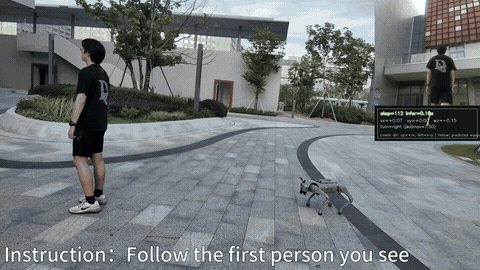
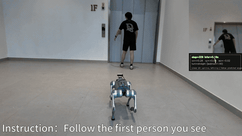
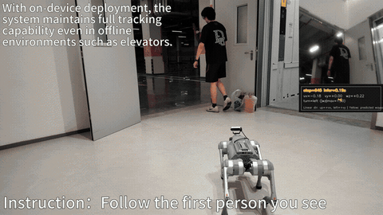
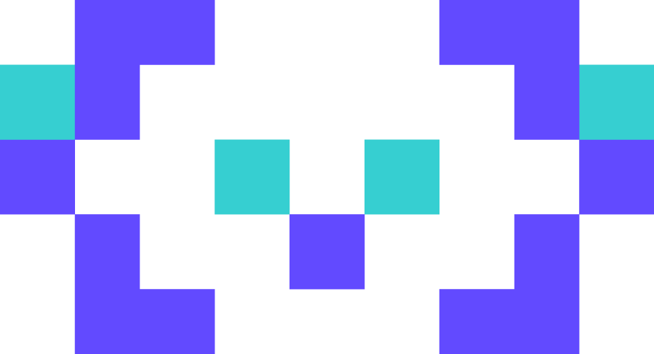

  

  <strong>A Smarter and Faster On-Device AI Brain for Robots</strong>

  <b>English</b> · <a href="./README_zh.md">中文</a>

    [![Lark](https://img.shields.io/badge/Lark-00D6B9?style=for-the-badge&logo=data:image/png;base64,iVBORw0KGgoAAAANSUhEUgAAAEAAAABACAYAAACqaXHeAAAIIklEQVR4nO2ba2xUxxXHf3Pvvte7Xhu/8WKDH6SEuJDSRKGQiEeAhrbhFaVpRBMoJaFSKlVVWj5Ujfr4EqSqaqOoRGkhTdQWiFq1jUjLI5AQ8gClJQQSwFCDY7CNwcZr73qf904/2AvGb+/OspHin+QP3nvvmTP/mTlzztxdIaWUfI7Rsu1AtpkQINsOZJsJAbLtQLaZECDbDmQbSyoPxaTJ5XiYRIZTCKum4dNsuDUdIURG2khJgOZ4D8+2nqItEVPvUT8sCKbaXGwsrGaq3Y1AvQgi1Uzwza5Wnm9v4GAkSFi5Wzez2O7m2bKZ3ObIVW475Rhwr6eYX5bOZLnTR06GpmeS/dEQL1xtIGYaym2nPAOSdBlxXmg7y687LxEgszHhpeJaVudXoClcCmnvAl7dyhNFNWzO91Op6Wq8GoaXOy9SH+lSalPJNujVrWwqquVXpV+gRk8pro6JA9Ee/tjegKlwpinLA6xCY4m3lJ8WVlOn21SZHcSO7nY+CLajqopXmghpCB70+fl5yfSMLYc2abKzs5EuI67EnvJMUBeCRZ4SflFcQ51uVW0egP2hAPXRbiW2MpIKa0Lwjb6Z4M/ATDhnJtjd2azEVsZqAQuCRZ5SnimcRrWmPjC+FrpKWzz9FEwDSab+NAErfX6e8E1W0un+tBgJDnVfSdtOxqtBh6bz7YJpPO0tJk9hxhhAciTUkXYwHDQ3DRN0xbLk6BY2FdXSnIjwp56AMrtnYyE6ElGscTjdEKC5Lcily93Ejd4t0qJpeD02yos9VPu9lBa7B9kQUpo3bajb9ggiCVi3GJx2dQmHBM5Hu3my6RjvxKPpGTNB7zbJ+V+UBRfcNJxsJxCME40ZhOMGos9tKcCma9itOg67BX+JmxULqrj7iyVUTfHicloHC7Bll2DvcXhsoWTtovT8HIhEsqerhc2tZzhrJFKzEZE4DwexHgtjno+CMf5BKivI4alH7mDd6hlDnwcEwpI/7BfoOqyaa+KwqVm7gt4c4aloDz++eoHwOFJaS1wijvXgOBjCbIxiptDxJJpmMm9OOUKMEARDUcm2fSY7D2kkFFahVqGxwufnQbdnzM/YgybO17uwvXINsyGS0qgnKfI5+dF35lBT4UUIMfIuEAgLXtwr+c3foTOUcpuDyLfa+H5BLffZHKPea+800be3I/8dgJiZdtuPfn06Dy2tQdN6Z/Wo8T6agFffhxd3C6IxdUvhDqePx/L8I96nB0xsuzrg4zAy/b5TNdnDxjUz0bUb/RjThmcY8Ncjks3bof5i+o7Qly4v805mfU4eziGu69dMHNvbMf7bcz2qp4PdqrNhVR15PvvNfozVgCHh8BnJlr8JzqlJw/FarDzim0LFgDMEW5eJ/dUOxJmwks4DVJd7WDLPjzYgGRt3ynP8guS7z8E/3xOE0kzFBXCPp4j1uTdSZf2aie337Yj/9CiZ9kkeX3E7/tKcQZ+nlPMFo/Dcbsm2vYKeNOOCAL7qK+M+qwPZN/KcjaRlcyDVfi9L5lUMeS3lpLezB15+S7Lxt/DeJwIjjdGqtOewRpYyaXtH38iry0DtVp0NK2dSXDBUpFFQDJ1plvxsh+SlfaktCSklTc1BDmw7j3FG/RuGqWU5LJlfMWjtJ1FS9rQHYeseyabn4chpQXyMWa5hSI6eaGPdT/ax951GEmkkOMOxfuVMyocogpIorftONcMzf+5NnFqvCcwRlkU8brD7zQv8cMshTjV0qHTjOrdV+rj/K1NGvEf5UU17EHa+CwdPSB6eD8vvEkzy3jyyTS1BfrfjI/7yr3pCkdSKotGw23TWfm0GZUXDjz6ZECBJWzds3QNvfQxL7xQs+5JEFwneePdTtu46wfH6duLpRM5RmDW9kOULpjHaGUzm3mIAcQM+apScbIR/vA9ecZnX9x0lHA5msllcLjdPfvPLlBWOXmtkVIAkJlDfAlKW4Ju6CHtXM8Gr9RixENJUuwQsdhePrribhXcVje1+pa2PghA6NlchNlchnkk19AQuEu5sJBJsxUykeUoEWOweZs++m++tqcRpH8MDt1qA/mhWFzkFtbjyKklEu4kEmugJNJGIdGEaMeQ48mBNt+LwTKas6k5+8K18JheM3Y+sCZBE023YXJOwuQrwFNcRDbURDV0m2n2ZaOgKZmL4tFizOnF4SnHnVZI7aQqPL7Ywb8b42s+6AP0Rmo7DU4rDU4JREMNIhDFiQWLBVuLREFKaaJoFi82F7sjF4S5CszixWa0snwNrF4BjnO9lP1MC3ECgW+zoFjs4fDi95cPfKWD+DNiwlDGv+/58RgUYGxYN7pkOmx+CvBzZV1uO00ZGPLsFaBosmwUbH4B8Dyl1nqEEKPAp8C7D5Dph1VxYf//41/xABhVD824Htz2z3/pKh3y35OnVvW+u0u08Q70aMyW88SG8chBOX4Jb93uSkUW3W2Hu9N5gV10GmqIxGiRAkotXYNfbgtc+kATVnlAN58qwV8rz4eF74YE54HUpbnU4AQAShqS5Q2PbHjh6TnJF7TfUBrpy03+aBtXFsLCud737chi1skup1ZEESBKNCU42woEPYd9xybUe9Y70F6CqGJbMgoWzoaIwMx2/3upYBEhimpLOkODwScHbn0BjG7QEIBJLL1DkOgWl+TCjHBbUwewqsFrlsOd4KhmXAP0JRQUt7fDpVTjdBKebJGdbek+ERgucQsCUAkFloaRuKtSWCfyFUJrfO/VvJSkLoJ7sbL2f+1+MTAiQbQeyzYQA2XYg20wIkG0Hss3/Ad9m22xHQgjPAAAAAElFTkSuQmCC)](assets/feishu_group.png)

**MiniCPM-Robot** is MiniCPM's embodied intelligence model family for real-world perception, decision-making, and action. The first models include:

- **MiniCPM-RobotManip**: 🦾 A **1.5B** generalist VLA for robot manipulation (sim & real). One set of weights across tasks; beats larger models such as π₀.₅ (3B) and Qwen-VLA (5B+) on representative evals. Streaming inference preserves native memory capabilities and maintains the same response speed as before.

- **MiniCPM-RobotTrack**: 🎯 The **first fully on-device** embodied target tracker (**0.9B**). Covers static, dynamic, and adversarial targets; **open-source SOTA on EVT-Bench**; runs **5+ FPS / ~180 ms** on Unitree Go2 EDU with fully local, vision-only natural-language tracking.

  

## 🎉 News

* [2026.07.19] 🔥🔥🔥 We release and open-source MiniCPM-Robot, MiniCPM's first embodied intelligence model family for interaction with the physical world. Its first releases are [MiniCPM-RobotManip](https://huggingface.co/openbmb/MiniCPM-RobotManip) for generalist robot manipulation and [MiniCPM-RobotTrack](https://huggingface.co/openbmb/MiniCPM-RobotTrack) for embodied target tracking. Try it now!

* [2026.07.19] 🚀🚀🚀 [PhyAI](https://github.com/MEmbodied/phyai) adds Day-0 support for MiniCPM-Robot, increasing inference throughput on NVIDIA H20 from 10 Hz to 37 Hz through CUDA Graph and custom Triton fused kernels.

## Contents

- [MiniCPM-RobotManip](#minicpm-robotmanip)
  - [Benchmark Results](#benchmark-results)
  - [Quick Start](#quick-start)
  - [Inference](#inference)
  - [Evaluation](#evaluation)
- [MiniCPM-RobotTrack](#minicpm-robottrack)
  - [Benchmark Results](#evt-bench-results)
  - [Quick Start](#quick-start-1)
  - [Cookbook](#data-preparation)
- [Model Zoo](#model-zoo)

## MiniCPM-RobotManip
<strong>MiniCPM-RobotManip</strong> is a 1.5B vision-language-action model for embodied manipulation with the following highlights:
<ul>
  <li><b>Generalist Manipulation:</b> A unified 1.5B generalist policy that covers all downstream tasks with one set of weights.</li>
  <li><b>Streaming Context:</b> Historical observations are incorporated into the model context through streaming inference. With 60 frames of history, traditional recomputation requires 125 TFLOPs per decision step, while streaming inference needs only 3.3 TFLOPs. The model supports up to 1 minute of visual context memory while keeping online cost comparable to traditional single-frame reactive inference.</li>
  <li><b>Efficient Inference:</b> Inherits MiniCPM-V 4.6's visual token compression, reducing each frame from 256 to 64 visual tokens for 4× compression. With H100, BF16, and single-frame input, model-forward latency per decision step is 120 ms, compared with 234 ms for π0.5. The measurement excludes task autoregressive decoding.</li>
</ul>

### Benchmark Results

<table align="center">
  <thead>
    <tr>
      <th rowspan="2">Method</th>
      <th rowspan="2">Eval Setting</th>
      <th rowspan="2">Open Weights</th>
      <th rowspan="2">Model Size</th>
      <th rowspan="2">LIBERO</th>
      <th rowspan="2">Calvin (ABC→D)</th>
      <th colspan="2">RoboTwin2 (clean+random)</th>
      <th rowspan="2">RMBench</th>
    </tr>
    <tr>
      <th>easy</th><th>hard</th>
    </tr>
  </thead>
  <tbody>
    <tr>
      <td>π₀</td><td>Specialist</td><td>✅</td><td>3B</td><td>94.4</td><td>3.9</td><td>65.9</td><td>58.4</td><td>&mdash;</td>
    </tr>
    <tr>
      <td>π₀.₅</td><td>Specialist</td><td>✅</td><td>3B</td><td>96.9</td><td>4.1</td><td>82.7</td><td>76.8</td><td>10.4</td>
    </tr>
    <tr>
      <td>Abot-M0</td><td>Specialist</td><td>✅</td><td>4B+</td><td>98.6</td><td>&mdash;</td><td>86.1</td><td>85.1</td><td>&mdash;</td>
    </tr>
    <tr>
      <td>StarVLA-α</td><td>Generalist</td><td>✅</td><td>4B+</td><td>97.8</td><td>&mdash;</td><td>88.7</td><td>87.8</td><td>&mdash;</td>
    </tr>
    <tr>
      <td>Qwen-VLA</td><td>Generalist</td><td>❌</td><td>5B+</td><td>97.9</td><td>&mdash;</td><td>86.1</td><td>87.2</td><td>&mdash;</td>
    </tr>
    <tr>
      <td>LingBot-VA</td><td>Specialist</td><td>✅</td><td>5B+</td><td>98.5</td><td>&mdash;</td><td>92.9</td><td>91.6</td><td>&mdash;</td>
    </tr>
    <tr>
      <td><b>MiniCPM-RobotManip</b></td><td>Generalist</td><td>✅</td><td><b>1.5B</b></td><td><b>97.5</b></td><td><b>4.1</b></td><td><b>91.3</b></td><td><b>91.6</b></td><td><b>53.3</b></td>
    </tr>
  </tbody>
</table>

### Quick Start

Install and initialize Conda first. The specification follows the tested Python 3.10 and PyTorch 2.6.0 (CUDA 12.4) setup.

<pre><code class="language-bash">cd MiniCPM-RobotManip
conda env create -f environment.yml
conda activate MiniCPM-RobotManip</code></pre>

### Inference

Run single-sample inference with <code>vla_infer.py</code>. Provide at least one image and a language instruction; robot state defaults to zeros if omitted. The model returns an action chunk of shape <code>(30, 80)</code>.

<pre><code class="language-bash">cd MiniCPM-RobotManip
python vla_infer.py \
    --image frame.jpg \
    --text "Pick up the red block." \
    --checkpoint ./checkpoint \
    --state-file state.npy \
    --embodiment-id 0 \
    --output action.npy</code></pre>

Use multiple <code>--image</code> flags for multi-view inputs. Without <code>--output</code>, the predicted action is printed as JSON.

<pre><code class="language-bash">cd MiniCPM-RobotManip
python vla_infer.py \
    --image cam_front.jpg \
    --image cam_wrist.jpg \
    --text "Pick up the red block." \
    --checkpoint ./checkpoint</code></pre>

### Evaluation

  Reproducible evaluation integrations for LIBERO, CALVIN, RoboTwin2, and RMBench
  are provided under <a href="MiniCPM-RobotManip/evaluation"><code>evaluation/</code></a>.
  The evaluators connect to the MiniCPM-RobotManip WebSocket + MessagePack model
  server; the model server and each benchmark simulator run in separate Python
  environments. Simulators, datasets, and assets are external dependencies and
  must be installed according to the corresponding benchmark guide.

<ul>
  <li><a href="MiniCPM-RobotManip/evaluation/README.md">Evaluation overview and common policy contract</a></li>
  <li><a href="MiniCPM-RobotManip/evaluation/libero/README.md">LIBERO</a></li>
  <li><a href="MiniCPM-RobotManip/evaluation/calvin/README.md">CALVIN</a></li>
  <li><a href="MiniCPM-RobotManip/evaluation/robotwin/README.md">RoboTwin2</a></li>
  <li><a href="MiniCPM-RobotManip/evaluation/rmbench/README.md">RMBench</a></li>
</ul>

## MiniCPM-RobotTrack
<strong>MiniCPM-RobotTrack</strong> is a compact vision-language-action policy for embodied target tracking built on MiniCPM4-0.5B with following highlights:

<ul>
  <li><b>Quality-driven self-evolving data pipeline:</b> automated checks and manual review remove abnormal trajectories, incorrect actions, and invalid interactions, while continual model-environment interaction adds high-value training samples.</li>
  <li><b>DAgger for embodied tracking:</b> after learning from large-scale general scenarios, the model interacts with simulators and real robots to expose failures in long-tail cases such as target crossings, rapid turns, short occlusions, and multi-person intersections. Samples corrected by expert policies or rules are aggregated into the next training round to continuously improve tracking and generalization.</li>
  <li><b>End-to-end Go2 optimization:</b> joint optimization across visual capture, input encoding, inference, action generation, command transmission, and execution delivers a stable <b>5+ FPS</b> with approximately <b>180 ms</b> end-to-end latency on the Unitree Go2's native onboard compute.</li>
  <li><b>One-command Go2 Edu deployment and launch:</b> the <a href="MiniCPM-RobotTrack/docs/GO2_DEPLOYMENT.md">local deployment workflow</a> covers environment setup, dependencies, model loading, camera input, text commands, robot control, and a one-command deployment-and-launch workflow, enabling fully local, vision-only natural-language tracking without rebuilding a separate perception, planning, and control stack.</li>
</ul>

### Examples

<table align="center">
  <tr>
    <td align="center" width="33%">
      
    </td>
    <td align="center" width="33%">
      
    </td>
    <td align="center" width="33%">
      
    </td>
  </tr>
  <tr>
    <td align="center"><b>Outdoor Obstacle-aware Tracking</b></td>
    <td align="center"><b>Elevator Tracking</b></td>
    <td align="center"><b>Underground Parking Tracking</b></td>
  </tr>
</table>

### EVT-Bench Results

  Results are reported as <b>SR / TR / CR</b>: success rate and tracking rate are higher-is-better, while collision rate is lower-is-better. All values are percentages.

<table align="center">
  <thead>
    <tr>
      <th rowspan="2">Method</th>
      <th rowspan="2">Open Weights</th>
      <th rowspan="2">Model Size</th>
      <th colspan="3">STT</th>
      <th colspan="3">DT</th>
      <th colspan="3">AT</th>
    </tr>
    <tr>
      <th>SR ↑</th><th>TR ↑</th><th>CR ↓</th>
      <th>SR ↑</th><th>TR ↑</th><th>CR ↓</th>
      <th>SR ↑</th><th>TR ↑</th><th>CR ↓</th>
    </tr>
  </thead>
  <tbody>
    <tr>
      <td>TrackVLA</td>
      <td>❌</td>
      <td>7.8B+</td>
      <td>85.1</td><td>78.6</td><td>1.7</td>
      <td>57.6</td><td>63.2</td><td>5.8</td>
      <td>50.2</td><td>63.7</td><td>17.1</td>
    </tr>
    <tr>
      <td>TrackVLA++</td>
      <td>❌</td>
      <td>7.8B+</td>
      <td>86.0</td><td>81.0</td><td>2.1</td>
      <td>66.5</td><td>68.8</td><td>4.7</td>
      <td>51.2</td><td>63.4</td><td>15.9</td>
    </tr>
    <tr>
      <td>Qwen-RobotNav</td>
      <td>❌</td>
      <td>4.4B+</td>
      <td>77.4</td><td>90.0</td><td>6.4</td>
      <td>&mdash;</td><td>&mdash;</td><td>&mdash;</td>
      <td>&mdash;</td><td>&mdash;</td><td>&mdash;</td>
    </tr>
    <tr>
      <td>OmTrackVLA</td>
      <td>✅</td>
      <td>1.0B+</td>
      <td>81.4</td><td>82.8</td><td>5.1</td>
      <td>41.5</td><td>58.8</td><td>11.3</td>
      <td>60.0</td><td>73.9</td><td>7.6</td>
    </tr>
    <tr>
      <td><b>MiniCPM-RobotTrack</b></td>
      <td>✅</td>
      <td><b>0.9B</b></td>
      <td><b>84.1</b></td><td><b>89.8</b></td><td><b>3.0</b></td>
      <td><b>53.2</b></td><td><b>73.4</b></td><td><b>13.6</b></td>
      <td><b>58.0</b></td><td><b>80.4</b></td><td><b>9.0</b></td>
    </tr>
  </tbody>
</table>

  Among the open-source checkpoints shown above, MiniCPM-RobotTrack obtains the best STT SR/TR/CR and the best DT SR/TR. It also reaches <b>80.35 TR</b> on AT with a 0.5B backbone.

### Quick Start

#### 1. Create the environment

Install and initialize Conda first. The specification follows the tested Python 3.9, Habitat-Sim 0.3.1, Bullet, PyTorch 2.4.1, and CUDA 12.1 setup.

<pre><code class="language-bash">cd MiniCPM-RobotTrack
conda env create -f environment.yml
conda activate MiniCPM-RobotTrack</code></pre>

#### 2. Prepare simulator data and assets

  Download HM3D, MP3D, humanoid, and robot assets following the
  <a href="https://github.com/facebookresearch/habitat-sim/blob/main/DATASETS.md">Habitat-Sim data instructions</a>
  and <a href="https://github.com/wsakobe/TrackVLA">TrackVLA asset instructions</a>.
  Preserve their original directory structure under the project's <code>data/</code> directory.

<pre><code>data/
├── datasets/
├── scene_datasets/
├── humanoids/
└── robots/</code></pre>

### Data Preparation

#### 1. Unprocessed rollouts

  Each Habitat rollout retains its video, per-step simulator state, and episode result.
  The runnable <a href="MiniCPM-RobotTrack/sim_data/raw_sample"><code>sim_data/raw_sample</code></a>
  example includes per-step records in the following format:

<pre><code class="language-json">{
  "base_velocity": [0.62, 0.00, 0.02],
  "collision": false,
  "target_distance": 1.72,
  "human_center_norm": [0.50, 0.48]
}</code></pre>

#### 2. Generate trajectory data

The command below keeps successful episodes, extracts RGB frames, and converts future actions into trajectory JSONL for finetuning:

<pre><code class="language-bash">cd MiniCPM-RobotTrack
python tools/make_tracking_data.py \
  --input_root sim_data/raw_sample \
  --output_root sim_data/train/stt \
  --only_success \
  --history 31 \
  --horizon 8 \
  --dt 0.1 \
  --incremental</code></pre>

For the full dataset, place the raw STT, DT, and AT rollouts under <code>sim_data/raw/&lt;task&gt;</code> and run the same command for each task.

#### 3. Pre-cache visual features

<pre><code class="language-bash">cd MiniCPM-RobotTrack
for task in stt dt at; do
  python tools/precompute_features.py \
    --json "sim_data/train/${task}/jsonl" \
    --data-root "sim_data/train/${task}" \
    --cache-root "sim_data/train/${task}/vision_cache"
done</code></pre>

  The processed outputs contain <code>frames/</code>, <code>jsonl/</code>, and
  <code>vision_cache/</code>.
  <a href="MiniCPM-RobotTrack/sim_data/sample"><code>sim_data/sample</code></a>
  provides two processed records for each of STT, DT, and AT, showing the final training-data format.

### Finetuning

After preparing data and visual caches for all three tasks, run the public finetuning entry point:

<pre><code class="language-bash">cd MiniCPM-RobotTrack
bash scripts/train.sh</code></pre>

Data paths, batch size, learning rates, and epoch count can be adjusted in <code>scripts/train.sh</code>.

### Evaluation

  Download the complete released Hugging Face snapshot to
  <code>minicpm_robot_track/checkpoints/MiniCPM-RobotTrack/</code>. It contains the
  fine-tuned MiniCPM4 backbone and is loaded with Transformers
  <code>from_pretrained</code>. Evaluation still requires DINOv3 ViT-S/16 and
  SigLIP So400m; existing local vision-model directories can be selected with
  environment variables:

<pre><code class="language-bash">export DINOV3_MODEL_PATH=/path/to/dinov3-vits16
export SIGLIP_MODEL_PATH=/path/to/siglip-so400m-patch14-384</code></pre>

After the environment, models, and simulator assets are ready, run the evaluation script for each task:

<pre><code class="language-bash">cd MiniCPM-RobotTrack
CKPT=minicpm_robot_track/checkpoints/MiniCPM-RobotTrack
bash scripts/eval_stt.sh "$CKPT" results/stt
bash scripts/eval_dt.sh  "$CKPT" results/dt
bash scripts/eval_at.sh  "$CKPT" results/at</code></pre>

Each command runs the evaluation for the corresponding task.

### Go2 Deployment

  The real-robot workflow targets a Unitree Go2 EDU with a Jetson Orin NX 16GB.
  The validated stack is Jetson Linux R36.5, CUDA 12.6, TensorRT 10.7,
  Python 3.10, ROS 2 Humble, and MAXN mode 0. Deployment uses separate Jetson
  dependencies and defaults to <code>dry-run</code>, which never sends motion
  commands.

<pre><code>Go2/D435i RGB -> TCP JPEG -> DINO + SigLIP TensorRT
              -> MiniCPM-RobotTrack -> waypoint -> rate-limited control</code></pre>

  The complete setup uses a Go2 EDU, Orin NX 16GB, and D435i. The built-in Go2
  front camera is the default validated source; each installation must validate
  the D435i RGB path separately. Detailed hardware parameters, network settings,
  asset download instructions, flashing instructions, and live-control procedures are kept
  in the deployment documentation:

<ul>
  <li><a href="MiniCPM-RobotTrack/docs/GO2_DEPLOYMENT.md">Go2 deployment and reproduction guide</a></li>
  <li><a href="MiniCPM-RobotTrack/docs/ASSETS.md">Model and deployment assets</a></li>
  <li><a href="MiniCPM-RobotTrack/docs/JETPACK6_UPGRADE.md">JetPack 6 upgrade guide</a></li>
</ul>

#### Quick Start

The following assumes JetPack 6 and the carrier-board patch are already installed:

  Download the checkpoint manually from
  <a href="https://huggingface.co/openbmb/MiniCPM-RobotTrack">openbmb/MiniCPM-RobotTrack</a>.
  Place the complete Hugging Face snapshot, including custom model code,
  tokenizer files, and <code>model.safetensors</code>, in
  <code>MiniCPM-RobotTrack/minicpm_robot_track/checkpoints/MiniCPM-RobotTrack/</code>
  before running preflight.

<pre><code class="language-bash">cd MiniCPM-RobotTrack

python3 scripts/download_upstream_assets.py

python3 -m pip install --user -r requirements-build.txt
./scripts/export_onnx.sh

sudo nvpmodel -m 0
sudo jetson_clocks
./scripts/build_engines.sh

./scripts/preflight.sh
./go2_runtime.py run</code></pre>

Status and shutdown:

<pre><code class="language-bash">cd MiniCPM-RobotTrack
./go2_runtime.py status
./go2_runtime.py stop-control
./go2_runtime.py stop</code></pre>

> **Safety:** Keep `runtime.mode: dry-run` for the first run. Before enabling
> live control, validate the camera, model, latency, and stop path on a stand
> with an on-site operator and a working remote/App emergency stop. Follow the
> [Go2 deployment guide](MiniCPM-RobotTrack/docs/GO2_DEPLOYMENT.md) for the
> complete live-control procedure and release limits.

## Model Zoo

| Model | Description | Download |
| --- | --- | --- |
| MiniCPM-RobotManip | A 1.5B vision-language-action model for Robot Manipulation | [🤗](https://huggingface.co/openbmb/MiniCPM-RobotManip)  |
| MiniCPM-RobotTrack | A 0.9B vision-language-action model for Target Tracking | [🤗](https://huggingface.co/openbmb/MiniCPM-RobotTrack)  |

## License

Model weights and code are open-sourced under the [Apache-2.0](./LICENSE) license.
## Acknowledgments

  MiniCPM-Robot builds on and references MiniCPM,
  <a href="https://github.com/starVLA/starVLA">starVLA</a>,
  <a href="https://github.com/huggingface/lerobot">LeRobot</a>,
  DINOv3, SigLIP, Habitat-Lab, Habitat-Sim, EVT-Bench, and TrackVLA.
  We thank the authors and communities for their open-source contributions.
  Third-party models, simulator code, datasets, and assets retain their own licenses; see
  <a href="MiniCPM-RobotTrack/THIRD_PARTY_NOTICES.md">THIRD_PARTY_NOTICES.md</a>.

