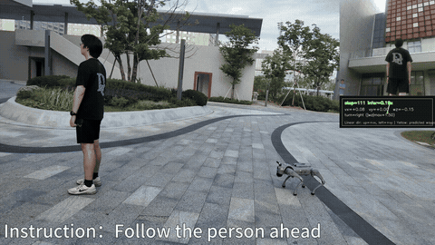
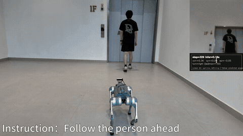
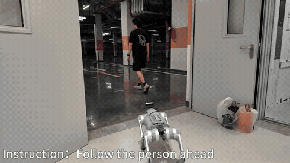

  

  <strong>更聪明、更快速的机器人端侧 AI 大脑</strong>

  <a href="./README.md">English</a> · <b>中文</b>

    [![Lark](https://img.shields.io/badge/Lark-00D6B9?style=for-the-badge&logo=data:image/png;base64,iVBORw0KGgoAAAANSUhEUgAAAEAAAABACAYAAACqaXHeAAAIIklEQVR4nO2ba2xUxxXHf3Pvvte7Xhu/8WKDH6SEuJDSRKGQiEeAhrbhFaVpRBMoJaFSKlVVWj5Ujfr4EqSqaqOoRGkhTdQWiFq1jUjLI5AQ8gClJQQSwFCDY7CNwcZr73qf904/2AvGb+/OspHin+QP3nvvmTP/mTlzztxdIaWUfI7Rsu1AtpkQINsOZJsJAbLtQLaZECDbDmQbSyoPxaTJ5XiYRIZTCKum4dNsuDUdIURG2khJgOZ4D8+2nqItEVPvUT8sCKbaXGwsrGaq3Y1AvQgi1Uzwza5Wnm9v4GAkSFi5Wzez2O7m2bKZ3ObIVW475Rhwr6eYX5bOZLnTR06GpmeS/dEQL1xtIGYaym2nPAOSdBlxXmg7y687LxEgszHhpeJaVudXoClcCmnvAl7dyhNFNWzO91Op6Wq8GoaXOy9SH+lSalPJNujVrWwqquVXpV+gRk8pro6JA9Ee/tjegKlwpinLA6xCY4m3lJ8WVlOn21SZHcSO7nY+CLajqopXmghpCB70+fl5yfSMLYc2abKzs5EuI67EnvJMUBeCRZ4SflFcQ51uVW0egP2hAPXRbiW2MpIKa0Lwjb6Z4M/ATDhnJtjd2azEVsZqAQuCRZ5SnimcRrWmPjC+FrpKWzz9FEwDSab+NAErfX6e8E1W0un+tBgJDnVfSdtOxqtBh6bz7YJpPO0tJk9hxhhAciTUkXYwHDQ3DRN0xbLk6BY2FdXSnIjwp56AMrtnYyE6ElGscTjdEKC5Lcily93Ejd4t0qJpeD02yos9VPu9lBa7B9kQUpo3bajb9ggiCVi3GJx2dQmHBM5Hu3my6RjvxKPpGTNB7zbJ+V+UBRfcNJxsJxCME40ZhOMGos9tKcCma9itOg67BX+JmxULqrj7iyVUTfHicloHC7Bll2DvcXhsoWTtovT8HIhEsqerhc2tZzhrJFKzEZE4DwexHgtjno+CMf5BKivI4alH7mDd6hlDnwcEwpI/7BfoOqyaa+KwqVm7gt4c4aloDz++eoHwOFJaS1wijvXgOBjCbIxiptDxJJpmMm9OOUKMEARDUcm2fSY7D2kkFFahVqGxwufnQbdnzM/YgybO17uwvXINsyGS0qgnKfI5+dF35lBT4UUIMfIuEAgLXtwr+c3foTOUcpuDyLfa+H5BLffZHKPea+800be3I/8dgJiZdtuPfn06Dy2tQdN6Z/Wo8T6agFffhxd3C6IxdUvhDqePx/L8I96nB0xsuzrg4zAy/b5TNdnDxjUz0bUb/RjThmcY8Ncjks3bof5i+o7Qly4v805mfU4eziGu69dMHNvbMf7bcz2qp4PdqrNhVR15PvvNfozVgCHh8BnJlr8JzqlJw/FarDzim0LFgDMEW5eJ/dUOxJmwks4DVJd7WDLPjzYgGRt3ynP8guS7z8E/3xOE0kzFBXCPp4j1uTdSZf2aie337Yj/9CiZ9kkeX3E7/tKcQZ+nlPMFo/Dcbsm2vYKeNOOCAL7qK+M+qwPZN/KcjaRlcyDVfi9L5lUMeS3lpLezB15+S7Lxt/DeJwIjjdGqtOewRpYyaXtH38iry0DtVp0NK2dSXDBUpFFQDJ1plvxsh+SlfaktCSklTc1BDmw7j3FG/RuGqWU5LJlfMWjtJ1FS9rQHYeseyabn4chpQXyMWa5hSI6eaGPdT/ax951GEmkkOMOxfuVMyocogpIorftONcMzf+5NnFqvCcwRlkU8brD7zQv8cMshTjV0qHTjOrdV+rj/K1NGvEf5UU17EHa+CwdPSB6eD8vvEkzy3jyyTS1BfrfjI/7yr3pCkdSKotGw23TWfm0GZUXDjz6ZECBJWzds3QNvfQxL7xQs+5JEFwneePdTtu46wfH6duLpRM5RmDW9kOULpjHaGUzm3mIAcQM+apScbIR/vA9ecZnX9x0lHA5msllcLjdPfvPLlBWOXmtkVIAkJlDfAlKW4Ju6CHtXM8Gr9RixENJUuwQsdhePrribhXcVje1+pa2PghA6NlchNlchnkk19AQuEu5sJBJsxUykeUoEWOweZs++m++tqcRpH8MDt1qA/mhWFzkFtbjyKklEu4kEmugJNJGIdGEaMeQ48mBNt+LwTKas6k5+8K18JheM3Y+sCZBE023YXJOwuQrwFNcRDbURDV0m2n2ZaOgKZmL4tFizOnF4SnHnVZI7aQqPL7Ywb8b42s+6AP0Rmo7DU4rDU4JREMNIhDFiQWLBVuLREFKaaJoFi82F7sjF4S5CszixWa0snwNrF4BjnO9lP1MC3ECgW+zoFjs4fDi95cPfKWD+DNiwlDGv+/58RgUYGxYN7pkOmx+CvBzZV1uO00ZGPLsFaBosmwUbH4B8Dyl1nqEEKPAp8C7D5Dph1VxYf//41/xABhVD824Htz2z3/pKh3y35OnVvW+u0u08Q70aMyW88SG8chBOX4Jb93uSkUW3W2Hu9N5gV10GmqIxGiRAkotXYNfbgtc+kATVnlAN58qwV8rz4eF74YE54HUpbnU4AQAShqS5Q2PbHjh6TnJF7TfUBrpy03+aBtXFsLCud737chi1skup1ZEESBKNCU42woEPYd9xybUe9Y70F6CqGJbMgoWzoaIwMx2/3upYBEhimpLOkODwScHbn0BjG7QEIBJLL1DkOgWl+TCjHBbUwewqsFrlsOd4KhmXAP0JRQUt7fDpVTjdBKebJGdbek+ERgucQsCUAkFloaRuKtSWCfyFUJrfO/VvJSkLoJ7sbL2f+1+MTAiQbQeyzYQA2XYg20wIkG0Hss3/Ad9m22xHQgjPAAAAAElFTkSuQmCC)](assets/feishu_group.png)

**MiniCPM-Robot** 是 MiniCPM 面向真实世界感知、决策与行动的具身智能模型系列。首批模型包括：

- **MiniCPM-RobotManip**：🦾 **1.5B** 通用机器人操作 VLA（仿真与真机）。一套权重覆盖下游任务，代表性评测中超过 π₀.₅ (3B)、 Qwen-VLA (5B+) 等更大模型。流式推理保留原生记忆能力，并且维持了和以前一样的响应速度。

- **MiniCPM-RobotTrack**：🎯 **首个纯端侧**具身目标跟踪方案（**0.9B**）。覆盖静态、动态与对抗目标，**EVT-Bench 开源 SOTA**；在 Unitree Go2 EDU 上可达 **5+ FPS / 约 180 ms**，纯视觉、纯本地自然语言跟踪。

  

## 🎉 最新动态

* [2026.07.19] 🔥🔥🔥 我们正式发布并开源了 MiniCPM-Robot，这是 MiniCPM 首个面向物理世界交互的具身智能模型系列。首批发布 [MiniCPM-RobotManip](https://huggingface.co/openbmb/MiniCPM-RobotManip) 与 [MiniCPM-RobotTrack](https://huggingface.co/openbmb/MiniCPM-RobotTrack)，分别面向通用机器人操作和具身目标跟踪。欢迎试用！

* [2026.07.19] 🚀🚀🚀 [PhyAI](https://github.com/MEmbodied/phyai) 已实现对 MiniCPM-Robot 的 Day-0 支持，通过 CUDA Graph 和 Triton 定制融合算子，将 NVIDIA H20 上的推理帧率从 10 Hz 提升至 37 Hz。

## 目录

- [MiniCPM-RobotManip](#minicpm-robotmanip)
  - [榜单结果](#榜单结果)
  - [快速开始](#快速开始)
  - [推理](#推理)
  - [模型评测](#模型评测)
- [MiniCPM-RobotTrack](#minicpm-robottrack)
  - [榜单结果](#evt-bench-结果)
  - [快速开始](#快速开始-1)
  - [Cookbook](#数据准备)
- [模型仓库](#模型仓库)

## MiniCPM-RobotManip
<strong>MiniCPM-RobotManip</strong> 是面向具身操作的 1.5B 视觉-语言-动作模型，主要亮点如下：
<ul>
  <li><b>通用操作：</b>统一的 1.5B generalist 策略，以一套权重覆盖所有下游任务。</li>
  <li><b>流式上下文：</b>将连续历史观测以流式方式纳入模型上下文。在保留 60 帧历史观测时，传统重新计算每个决策步需要 125 TFLOPs，流式推理仅需 3.3 TFLOPs；同时支持长达 1 分钟的视觉上下文记忆，在线成本仍与传统单帧反应式推理相当。</li>
  <li><b>高效推理：</b>继承 MiniCPM-V 4.6 的视觉 Token 压缩能力，将每帧视觉 Token 从 256 压缩至 64，实现 4× 压缩。在 H100、BF16、单帧输入设置下，每决策步模型前向时延为 120 ms，低于 π0.5 的 234 ms。时延仅统计模型前向，不包含任务自回归解码。</li>
</ul>

### 榜单结果

<table align="center">
  <thead>
    <tr>
      <th rowspan="2">方法</th>
      <th rowspan="2">评测设置</th>
      <th rowspan="2">开源权重</th>
      <th rowspan="2">参数规模 (VL+A)</th>
      <th rowspan="2">LIBERO</th>
      <th rowspan="2">Calvin (ABC→D)</th>
      <th colspan="2">RoboTwin2 (clean+random)</th>
      <th rowspan="2">RMBench</th>
    </tr>
    <tr>
      <th>easy</th><th>hard</th>
    </tr>
  </thead>
  <tbody>
    <tr>
      <td>π₀</td><td>Specialist</td><td>✅</td><td>3B</td><td>94.4</td><td>3.9</td><td>65.9</td><td>58.4</td><td>&mdash;</td>
    </tr>
    <tr>
      <td>π₀.₅</td><td>Specialist</td><td>✅</td><td>3B</td><td>96.9</td><td>4.1</td><td>82.7</td><td>76.8</td><td>10.4</td>
    </tr>
    <tr>
      <td>Abot-M0</td><td>Specialist</td><td>✅</td><td>4B+</td><td>98.6</td><td>&mdash;</td><td>86.1</td><td>85.1</td><td>&mdash;</td>
    </tr>
    <tr>
      <td>StarVLA-α</td><td>Generalist</td><td>✅</td><td>4B+</td><td>97.8</td><td>&mdash;</td><td>88.7</td><td>87.8</td><td>&mdash;</td>
    </tr>
    <tr>
      <td>Qwen-VLA</td><td>Generalist</td><td>❌</td><td>5B+</td><td>97.9</td><td>&mdash;</td><td>86.1</td><td>87.2</td><td>&mdash;</td>
    </tr>
    <tr>
      <td>LingBot-VA</td><td>Specialist</td><td>✅</td><td>5B+</td><td>98.5</td><td>&mdash;</td><td>92.9</td><td>91.6</td><td>&mdash;</td>
    </tr>
    <tr>
      <td><b>MiniCPM-RobotManip</b></td><td>Generalist</td><td>✅</td><td><b>1.5B</b></td><td><b>97.5</b></td><td><b>4.1</b></td><td><b>91.3</b></td><td><b>91.6</b></td><td><b>53.3</b></td>
    </tr>
  </tbody>
</table>

### 快速开始

请先安装并初始化 Conda。环境配置基于已验证的 Python 3.10 和 PyTorch 2.6.0（CUDA 12.4）。

<pre><code class="language-bash">cd MiniCPM-RobotManip
conda env create -f environment.yml
conda activate MiniCPM-RobotManip</code></pre>

### 推理

使用 <code>vla_infer.py</code> 进行单样本推理。至少提供一张图像和一条语言指令；若未提供机器人状态，则默认使用全零向量。模型输出动作序列，形状为 <code>(30, 80)</code>。

<pre><code class="language-bash">cd MiniCPM-RobotManip
python vla_infer.py \
    --image frame.jpg \
    --text "Pick up the red block." \
    --checkpoint ./checkpoint \
    --state-file state.npy \
    --embodiment-id 0 \
    --output action.npy</code></pre>

多视角输入可重复使用 <code>--image</code>。未指定 <code>--output</code> 时，预测动作将以 JSON 打印。

<pre><code class="language-bash">cd MiniCPM-RobotManip
python vla_infer.py \
    --image cam_front.jpg \
    --image cam_wrist.jpg \
    --text "Pick up the red block." \
    --checkpoint ./checkpoint</code></pre>

### 模型评测

  <a href="MiniCPM-RobotManip/evaluation"><code>evaluation/</code></a>
  目录提供 LIBERO、CALVIN、RoboTwin2 和 RMBench 的可复现评测流程。
  评测客户端通过 WebSocket + MessagePack 连接 MiniCPM-RobotManip 模型服务；
  模型服务与各基准模拟器分别运行在独立的 Python 环境中。模拟器、数据集和资产属于
  外部依赖，需按照相应基准的文档另行安装。

<ul>
  <li><a href="MiniCPM-RobotManip/evaluation/README.md">评测总览与通用策略接口约定</a></li>
  <li><a href="MiniCPM-RobotManip/evaluation/libero/README.md">LIBERO</a></li>
  <li><a href="MiniCPM-RobotManip/evaluation/calvin/README.md">CALVIN</a></li>
  <li><a href="MiniCPM-RobotManip/evaluation/robotwin/README.md">RoboTwin2</a></li>
  <li><a href="MiniCPM-RobotManip/evaluation/rmbench/README.md">RMBench</a></li>
</ul>

## MiniCPM-RobotTrack
<strong>MiniCPM-RobotTrack</strong> 是基于 MiniCPM4-0.5B 的轻量视觉-语言-动作策略，面向具身目标跟踪，主要亮点如下：

<ul>
  <li><b>高质量数据驱动的自进化管线：</b>通过自动检测与人工复核，系统清洗异常轨迹、错误动作和无效交互，并在模型与环境的持续交互中不断补充高价值训练样本。</li>
  <li><b>面向具身追踪的 DAgger 闭环：</b>模型先从大规模通用场景中学习基础能力，再通过仿真与真实机器人交互暴露目标横穿、快速转向、短时遮挡和多人交叉等长尾问题；经专家策略或规则纠偏的样本将聚合到下一轮训练中，持续提升追踪与泛化能力。</li>
  <li><b>Go2 端到端全链路优化：</b>协同优化视觉采集、输入编码、模型推理、动作生成、指令传输与机器人执行，在 Unitree Go2 原生本地算力上稳定达到 <b>5+ FPS</b>，端到端响应时延约 <b>180 ms</b>。</li>
  <li><b>Go2 Edu 一键部署启动：</b><a href="MiniCPM-RobotTrack/docs/GO2_DEPLOYMENT_zh-CN.md">本地部署流程</a>覆盖环境与依赖配置、模型加载、摄像头接入、文本指令、机器人控制接口及一键部署启动流程，无需重新搭建独立的感知、规划和控制系统，即可获得纯视觉、纯本地的自然语言指令追踪能力。</li>
</ul>

### 示例

<table align="center">
  <tr>
    <td align="center" width="33%">
      
    </td>
    <td align="center" width="33%">
      
    </td>
    <td align="center" width="33%">
      
    </td>
  </tr>
  <tr>
    <td align="center"><b>户外障碍追踪</b></td>
    <td align="center"><b>电梯场景追踪</b></td>
    <td align="center"><b>地下车库追踪</b></td>
  </tr>
</table>

### EVT-Bench 结果

  指标顺序为 <b>SR / TR / CR</b>：成功率与跟踪率越高越好，碰撞率越低越好；表中数值均为百分比。

<table align="center">
  <thead>
    <tr>
      <th rowspan="2">方法</th>
      <th rowspan="2">开源权重</th>
      <th rowspan="2">参数规模 (VL+A)</th>
      <th colspan="3">STT</th>
      <th colspan="3">DT</th>
      <th colspan="3">AT</th>
    </tr>
    <tr>
      <th>SR ↑</th><th>TR ↑</th><th>CR ↓</th>
      <th>SR ↑</th><th>TR ↑</th><th>CR ↓</th>
      <th>SR ↑</th><th>TR ↑</th><th>CR ↓</th>
    </tr>
  </thead>
  <tbody>
    <tr>
      <td>TrackVLA</td>
      <td>❌</td>
      <td>7.8B+</td>
      <td>85.1</td><td>78.6</td><td>1.7</td>
      <td>57.6</td><td>63.2</td><td>5.8</td>
      <td>50.2</td><td>63.7</td><td>17.1</td>
    </tr>
    <tr>
      <td>TrackVLA++</td>
      <td>❌</td>
      <td>7.8B+</td>
      <td>86.0</td><td>81.0</td><td>2.1</td>
      <td>66.5</td><td>68.8</td><td>4.7</td>
      <td>51.2</td><td>63.4</td><td>15.9</td>
    </tr>
    <tr>
      <td>Qwen-RobotNav</td>
      <td>❌</td>
      <td>4.4B+</td>
      <td>77.4</td><td>90.0</td><td>6.4</td>
      <td>&mdash;</td><td>&mdash;</td><td>&mdash;</td>
      <td>&mdash;</td><td>&mdash;</td><td>&mdash;</td>
    </tr>
    <tr>
      <td>OmTrackVLA</td>
      <td>✅</td>
      <td>1.0B+</td>
      <td>81.4</td><td>82.8</td><td>5.1</td>
      <td>41.5</td><td>58.8</td><td>11.3</td>
      <td>60.0</td><td>73.9</td><td>7.6</td>
    </tr>
    <tr>
      <td><b>MiniCPM-RobotTrack</b></td>
      <td>✅</td>
      <td><b>0.9B</b></td>
      <td><b>84.1</b></td><td><b>89.8</b></td><td><b>3.0</b></td>
      <td><b>53.2</b></td><td><b>73.4</b></td><td><b>13.6</b></td>
      <td><b>58.0</b></td><td><b>80.4</b></td><td><b>9.0</b></td>
    </tr>
  </tbody>
</table>

  在表中列出的开源 checkpoint 里，MiniCPM-RobotTrack 获得 STT 的最佳 SR/TR/CR 和 DT 的最佳 SR/TR，并以 0.5B 骨干在 AT 上取得 <b>80.35 TR</b>。

### 快速开始

#### 1. 配置环境

请先安装并初始化 Conda。环境配置基于已验证的 Python 3.9、Habitat-Sim 0.3.1、Bullet、PyTorch 2.4.1 和 CUDA 12.1。

<pre><code class="language-bash">cd MiniCPM-RobotTrack
conda env create -f environment.yml
conda activate MiniCPM-RobotTrack</code></pre>

#### 2. 准备仿真数据与资产

  按照
  <a href="https://github.com/facebookresearch/habitat-sim/blob/main/DATASETS.md">Habitat-Sim 数据说明</a>
  和 <a href="https://github.com/wsakobe/TrackVLA">TrackVLA 资产说明</a>
  下载 HM3D、MP3D、人物与机器人资产，并保持其在项目 <code>data/</code> 下的原始目录结构。

<pre><code>data/
├── datasets/
├── scene_datasets/
├── humanoids/
└── robots/</code></pre>

### 数据准备

#### 1. 未处理的 rollout

  每个 Habitat rollout 保留视频、逐步状态和 episode 结果。仓库中的
  <a href="MiniCPM-RobotTrack/sim_data/raw_sample"><code>sim_data/raw_sample</code></a>
  提供了一个可运行的原始样例，其中逐步状态格式如下：

<pre><code class="language-json">{
  "base_velocity": [0.62, 0.00, 0.02],
  "collision": false,
  "target_distance": 1.72,
  "human_center_norm": [0.50, 0.48]
}</code></pre>

#### 2. 生成 trajectory 数据

下面的命令会筛选成功 episode、抽取 RGB 帧，并根据未来动作生成用于微调的 trajectory JSONL：

<pre><code class="language-bash">cd MiniCPM-RobotTrack
python tools/make_tracking_data.py \
  --input_root sim_data/raw_sample \
  --output_root sim_data/train/stt \
  --only_success \
  --history 31 \
  --horizon 8 \
  --dt 0.1 \
  --incremental</code></pre>

处理完整数据时，将 STT、DT、AT 的原始 rollout 分别写入 <code>sim_data/raw/&lt;task&gt;</code>，并为每个任务执行同一命令。

#### 3. 预缓存视觉特征

<pre><code class="language-bash">cd MiniCPM-RobotTrack
for task in stt dt at; do
  python tools/precompute_features.py \
    --json "sim_data/train/${task}/jsonl" \
    --data-root "sim_data/train/${task}" \
    --cache-root "sim_data/train/${task}/vision_cache"
done</code></pre>

  处理结果包含 <code>frames/</code>、<code>jsonl/</code> 和 <code>vision_cache/</code>。
  <a href="MiniCPM-RobotTrack/sim_data/sample"><code>sim_data/sample</code></a>
  提供 STT、DT、AT 各两条已处理记录，可直接查看最终训练数据格式。

### 微调

准备三个任务的数据与视觉缓存后，运行公开的 finetune 入口：

<pre><code class="language-bash">cd MiniCPM-RobotTrack
bash scripts/train.sh</code></pre>

数据路径、batch size、学习率与训练轮数均可在 <code>scripts/train.sh</code> 中调整。

### 模型测评

  将完整的 Hugging Face snapshot 下载到
  <code>minicpm_robot_track/checkpoints/MiniCPM-RobotTrack/</code>。该 snapshot 已包含
  微调后的 MiniCPM4 backbone，并通过 Transformers <code>from_pretrained</code> 加载。
  测评仍需要 DINOv3 ViT-S/16 和 SigLIP So400m；可以通过环境变量指定已经下载的
  视觉模型目录：

<pre><code class="language-bash">export DINOV3_MODEL_PATH=/path/to/dinov3-vits16
export SIGLIP_MODEL_PATH=/path/to/siglip-so400m-patch14-384</code></pre>

环境、模型和仿真资产准备完成后，分别执行三个任务的测评脚本：

<pre><code class="language-bash">cd MiniCPM-RobotTrack
CKPT=minicpm_robot_track/checkpoints/MiniCPM-RobotTrack
bash scripts/eval_stt.sh "$CKPT" results/stt
bash scripts/eval_dt.sh  "$CKPT" results/dt
bash scripts/eval_at.sh  "$CKPT" results/at</code></pre>

每条命令会完成对应任务测评。

### Go2 实机部署

  实机流程面向配备 Jetson Orin NX 16GB 的 Unitree Go2 EDU。已验证环境为
  Jetson Linux R36.5、CUDA 12.6、TensorRT 10.7、Python 3.10、ROS 2 Humble
  和 MAXN mode 0。部署使用独立的 Jetson 依赖，并默认运行在不会下发运动命令的
  <code>dry-run</code> 模式。

<pre><code>Go2/D435i RGB -> TCP JPEG -> DINO + SigLIP TensorRT
              -> MiniCPM-RobotTrack -> waypoint -> 限速控制</code></pre>

  完整配置包括 Go2 EDU、Orin NX 16GB 和 D435i。仓库默认并已实机验证的是
  Go2 前置相机，每套新设备仍须单独验证 D435i RGB 链路。详细硬件参数、网络配置、
  资产下载、刷机方法和实控流程统一放在部署文档中：

<ul>
  <li><a href="MiniCPM-RobotTrack/docs/GO2_DEPLOYMENT_zh-CN.md">Go2 部署与复现指南</a></li>
  <li><a href="MiniCPM-RobotTrack/docs/ASSETS_zh-CN.md">模型与部署资产</a></li>
  <li><a href="MiniCPM-RobotTrack/docs/JETPACK6_UPGRADE_zh-CN.md">JetPack 6 升级指南</a></li>
</ul>

#### 快速开始

下面假设 JetPack 6 和载板补丁已经完成：

  使用者需要自行从
  <a href="https://huggingface.co/openbmb/MiniCPM-RobotTrack">openbmb/MiniCPM-RobotTrack</a>
  下载完整的 Hugging Face snapshot，并将其中的自定义模型代码、tokenizer 文件和
  <code>model.safetensors</code> 放到
  <code>MiniCPM-RobotTrack/minicpm_robot_track/checkpoints/MiniCPM-RobotTrack/</code>，
  再运行预检。

<pre><code class="language-bash">cd MiniCPM-RobotTrack

python3 scripts/download_upstream_assets.py

python3 -m pip install --user -r requirements-build.txt
./scripts/export_onnx.sh

sudo nvpmodel -m 0
sudo jetson_clocks
./scripts/build_engines.sh

./scripts/preflight.sh
./go2_runtime.py run</code></pre>

状态与停止：

<pre><code class="language-bash">cd MiniCPM-RobotTrack
./go2_runtime.py status
./go2_runtime.py stop-control
./go2_runtime.py stop</code></pre>

> **安全提示：**首次运行必须保留 `runtime.mode: dry-run`。启用实控前，应在支架上
> 完成相机、模型、时延和停车链路验证，并确保现场有人且遥控器/App 急停可用。
> 完整实控步骤与限速要求见 [Go2 部署指南](MiniCPM-RobotTrack/docs/GO2_DEPLOYMENT_zh-CN.md)。

## 模型仓库

| 模型 | 简介 | 下载 |
| --- | --- | --- |
| MiniCPM-RobotManip | 面向机器人操作（Robot Manipulation）的 1.5B 视觉-语言-动作模型 | [🤗](https://huggingface.co/openbmb/MiniCPM-RobotManip)  |
| MiniCPM-RobotTrack | 面向目标跟踪（Target Tracking）的 0.9B 视觉-语言-动作模型 | [🤗](https://huggingface.co/openbmb/MiniCPM-RobotTrack)  |

## 许可证

模型权重与代码均基于 [Apache-2.0](./LICENSE) 许可证开源。
## 致谢

  MiniCPM-Robot 的开发参考并基于 MiniCPM、
  <a href="https://github.com/starVLA/starVLA">starVLA</a>、
  <a href="https://github.com/huggingface/lerobot">LeRobot</a>、
  DINOv3、SigLIP、Habitat-Lab、Habitat-Sim、EVT-Bench 和 TrackVLA。
  感谢相关作者与社区的开源贡献。
  第三方模型、仿真代码、数据集与资产继续遵循各自许可，详见
  <a href="MiniCPM-RobotTrack/THIRD_PARTY_NOTICES.md">THIRD_PARTY_NOTICES.md</a>。

